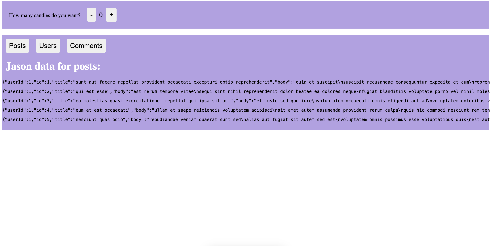

Heyoo!!
I didn't write the blogpost after working on useEffect the other day. I completed using the useEffect hook though, using [this tutorial](https://www.youtube.com/watch?v=0ZJgIjIuY7U&list=PLZlA0Gpn_vH8EtggFGERCwMY5u5hOjf-h&index=2) by [Web Dev Simplified](https://youtube.com/@WebDevSimplified).

I created [this](https://demo-hooks-gois5w8ps-sahibkaur.vercel.app/):

 

 Here, when you click on posts, comments or users, the text below will change and so will the json data, showing posts, comments and users respectively.

 Now, here the useEffect() hook is that it is used when we want to call a function a specific resource changes or a component mounts. So, the second parameter helps in that, it is an array. Any value in the array changes , then the hook is called.

 ```
     useEffect(() => {
        fetch(`https://jsonplaceholder.typicode.com/${resourceType}`)
      .then(response => response.json())
      .then(json => setItems(json))
    }, [resourceType]);
```

You can check the complete code [here](https://github.com/sahibkaur/demo-hooks/pull/1/commits/65ca7b67c8aff91e546a76797fcc19a985ab9d57).

I also added the functionality to show the window width dynamically as was shown in the tutorial video, but since we cannot use `window` directly in next.js. I had to find a solution for that. I found [this](https://medium.com/@saileshadhikari72/handling-window-is-not-defined-error-in-react-and-next-js-for-client-side-code-993eec31bc48).

Which shows the solution to conditionally render. Here's a snippet from the blog:

    Implement Conditional Rendering
    Wrap the code that relies on the window object inside a conditional check. We’ll use the (typeof window !== ‘undefined’) condition to ensure that the code is executed only in a browser environment.

    `if(typeof window !== 'undefined')
    {
    // Your client-side code that uses window goes here
    }`


I also had another error, which was 
` Error: Missing "key" prop for element in iterator  react/jsx-key`

Apparently, you gotta use key while using the map function. I honestly don't know the reason yet. So, this is how I tried tackling it, but it still gives warning - the code got deployed tho, without errors.

```
            {items.map(item => {
                return <pre key="item.userId">{JSON.stringify(item)}</pre>
            }).slice(0,5)}
```

This is the warning I get:

    app-index.js:34 Warning: Encountered two children with the same key, `item.userId`. Keys should be unique so that components maintain their identity across updates. Non-unique keys may cause children to be duplicated and/or omitted — the behavior is unsupported and could change in a future version.

I'll let you know the next progress. I am aiming to do hooks before the next blogpost.

Toodles!
