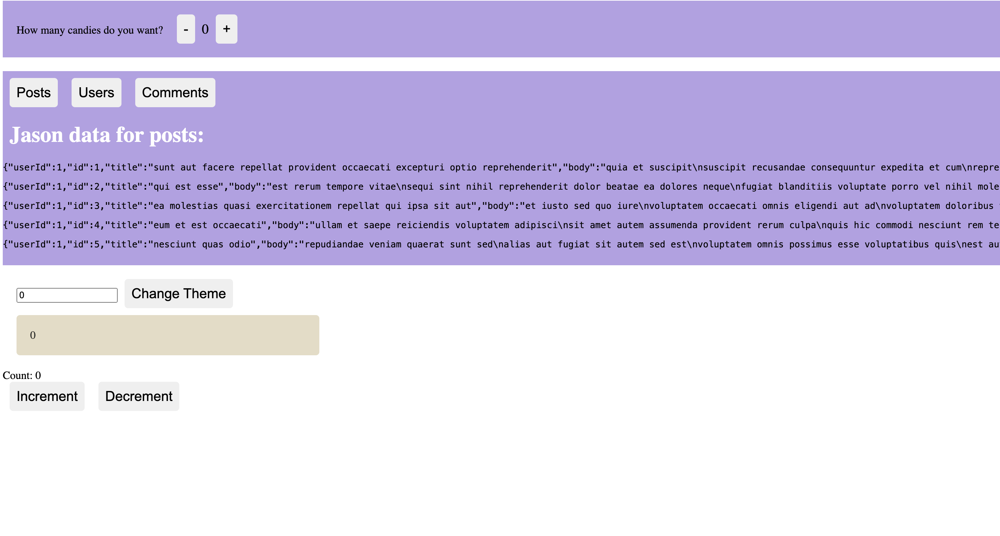

Heloo people!!
Today I worked on the hook useReducer() from [this tutorial](https://www.youtube.com/watch?v=rgp_iCVS8ys).

Here's what I have for now

 

 [deployed here](https://demo-hooks.vercel.app/)

 The code works this way, when we click on the Increment button, the count increases, but when it reaches "5", and increment, we encounter an error "Maximum reached". Similarly, when we decrement, we can't decrement less than 0.

 But my code doesn't work. I'll have a look at it tomorrow.

 Also, useReducer works this way - it has the same functionality as useState, the only difference is that it doesn't make change directly on the state, rather makes a copy first and then returns the updated state - which is then used to replace the previous state.

 Tomorrow, I will finish off all the hooks.

Toodles!
