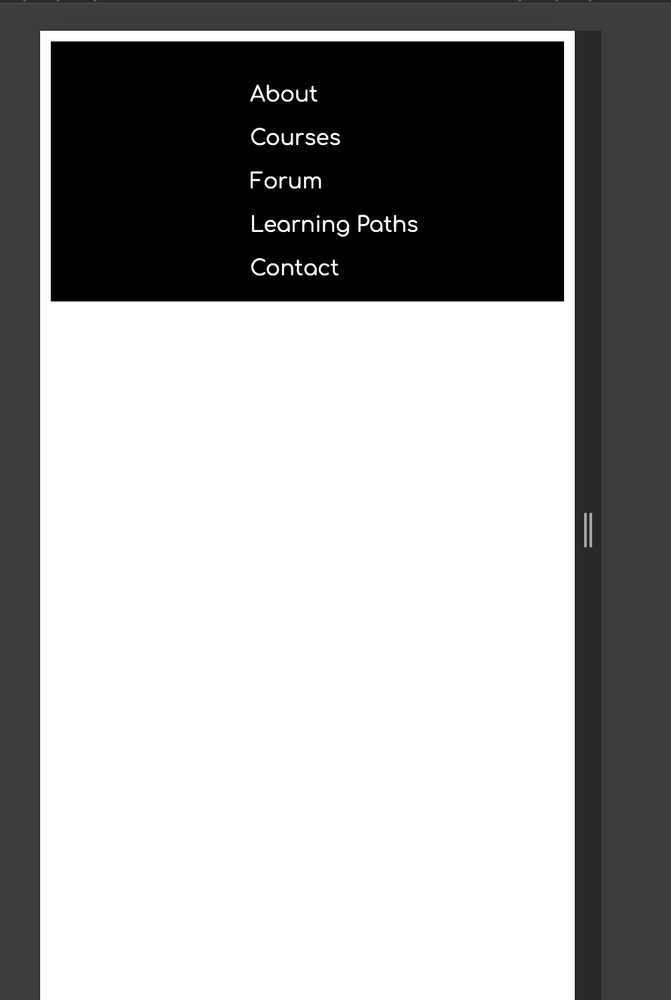

Heloo people!!

I was on the second part. I revised layouts and media queries. Here are the notes:

relative: relative to the element’s original position
absolute: relative to the parent
fixed: relative to the viewport

Flexbox
Justify-content: along the main axis
Align-items: along the cross axis
Align-content: 
Grid-template-rows: repeat(3, 100px)
Grid-template-columns: repeat(2, 100px)

[Here's](https://sahibkaur.github.io/course-demo/exercise-part2.html) the deployed version of the exercise I did.

In the exercise, I had to create a navigation in mobile and desktop view. 
I did the following:

That's it for today.

See ya tomorrow.
Toodles!

