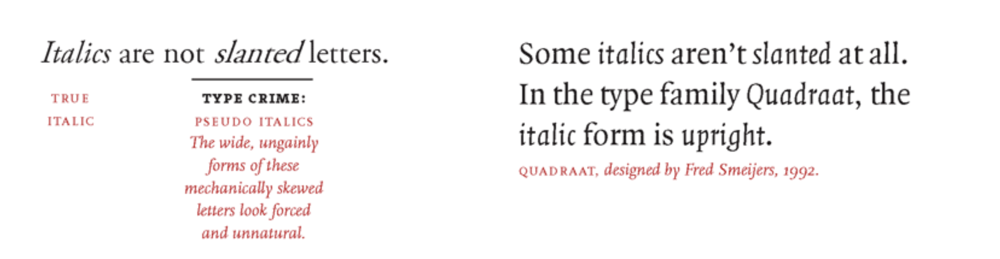
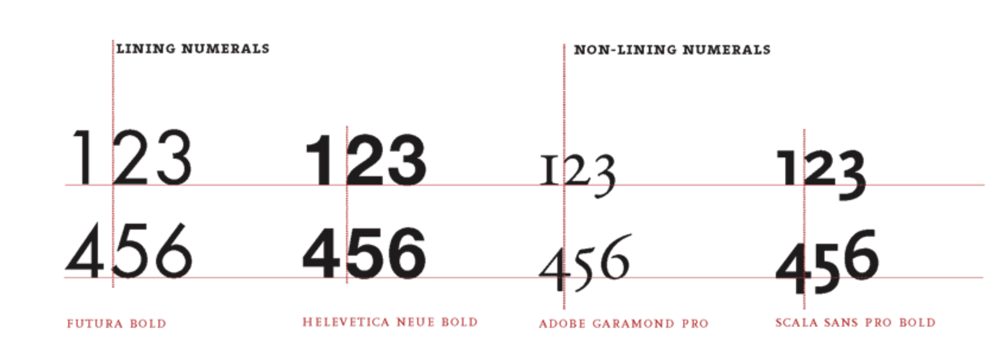
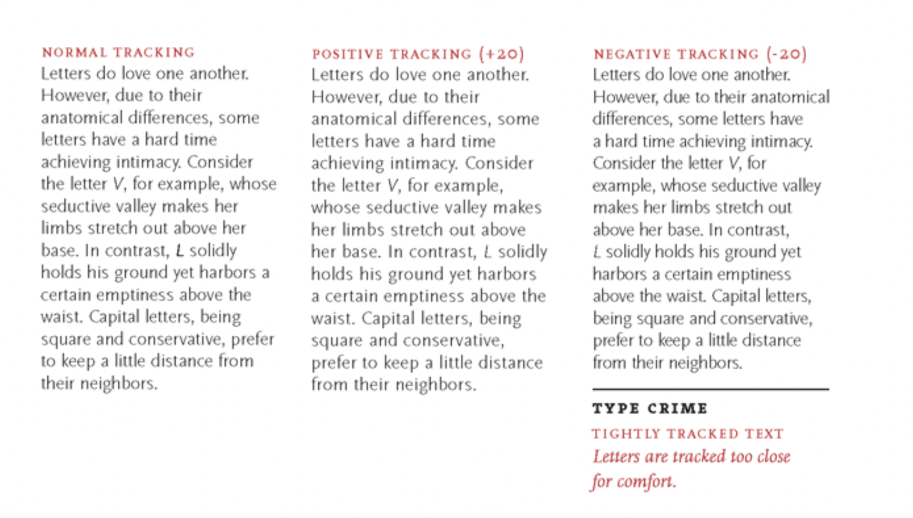
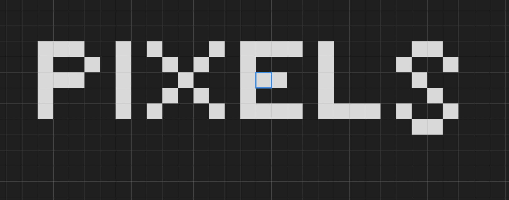
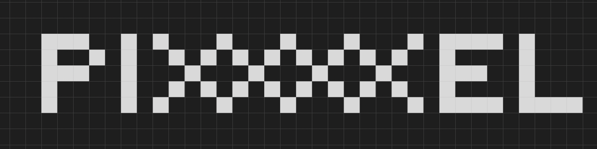
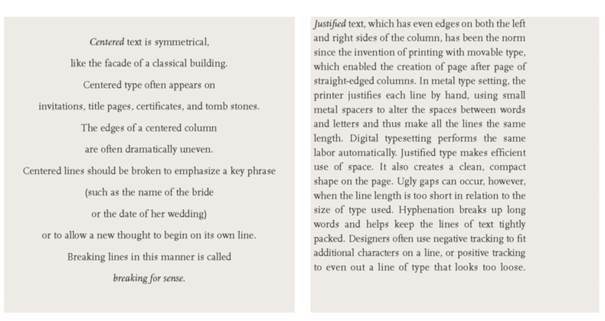
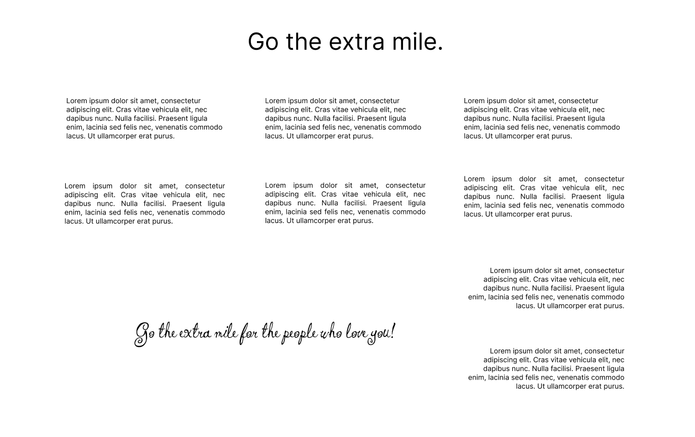
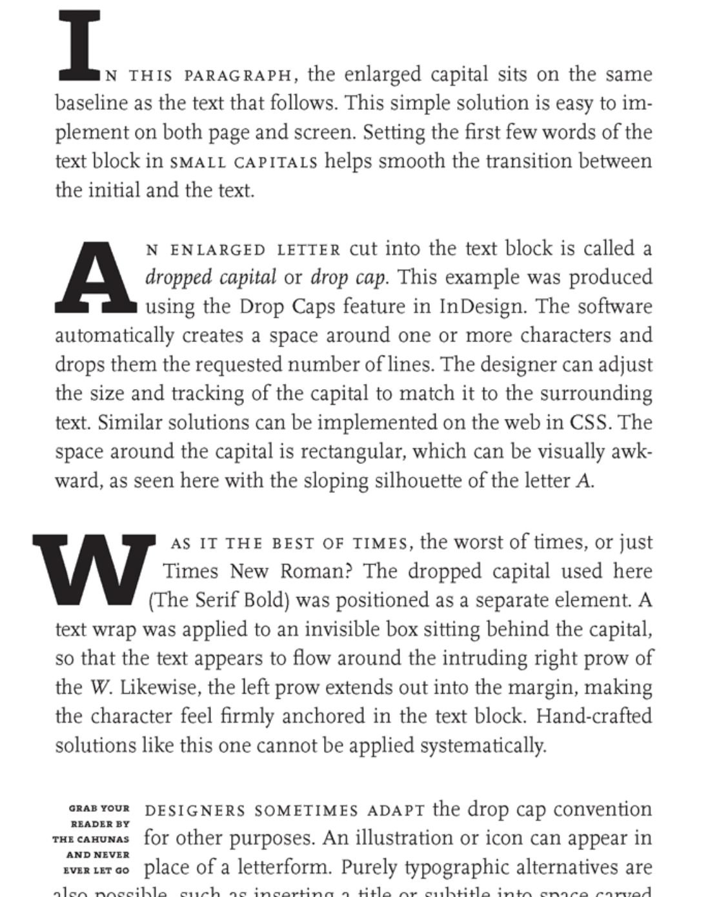
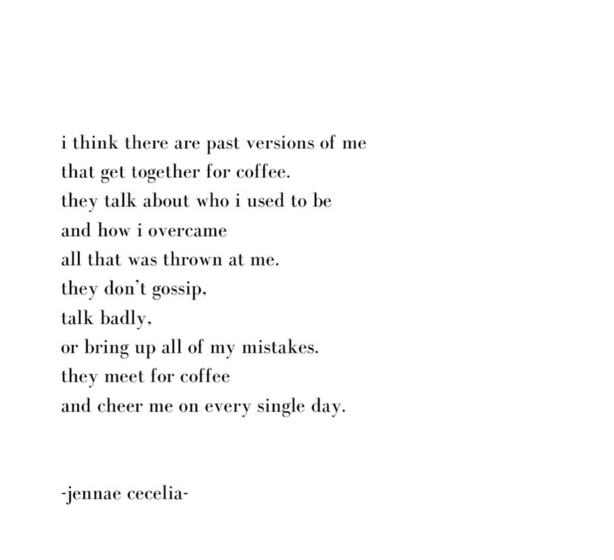
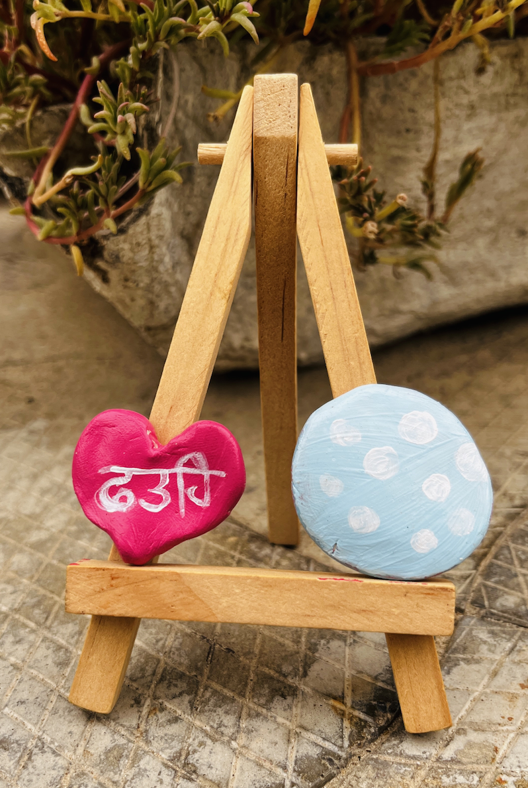

Hello,

Today I completed the Letter section and most of the Text section of [my Typography task](https://web.archive.org/web/20161001194457/http://thinkingwithtype.com/).

Here are the notes

### Set width

- Set width is the size of the letter plus the space beside it.
- The letters in the compressed version of a typeface have a narrower set width.
- Some typefaces that work well at large sizes look too fragile when reduced.

### About headlines, text and captions

- A display or headline style looks spindly and weak when set at small sizes. Display styles are intended for use at 24 pts. and larger.
- Basic text styles are designed for sizes ranging from 9 to 14 pts. Their features are strong and meaty but not too assertive.
- Caption styles are built with the heaviest stroke weight. They are designed from sizes ranging from 6 to 8 pts.

### A lil' about Scale

- Scale is the size of design elements in comparison to other elements in a layout as well as to the physical context of the work.
- Scale is relative. 12-pt type displayed on a 32-inch monitor can look very small, while 12-pt type printed on a book page can look flabby and overweight.

### Type Families

- The roman form, also called plain or regular, is the standard, upright version of a typeface.
- _The italic form is used to create emphasis._
- Small caps (capitals) are designed to integrate with a line of text where full-size capitals would stand out awkwardly.
- Bold versions of traditional text fonts were added in the twentieth century to meet the need for emphatic forms.

_Italics are not slanted letter_

### Mixing Typefaces

- Combining typefaces is like making a salad.
- When mixing typefaces on the same line, designers usually adjust the point size so that the x-heights align.

### Lining and Non-lining Numerals

### Steps to design your own typeface:

- The first step in designing a typeface is to define a basic concept. Will the letters be serif or sans serif? Will they be modular or organic? Will you construct them geometrically or base them on handwriting? Will you use them for display or for text? Will you work with historic source material or invent the characters more or less from scratch?
- The next step is to create drawings. Some designers start with pencil before working digitally, while others build their letterforms directly with fontdesign software.
- Begin by drawing a few core letters, such as o, u, h, and n, building curves, lines, and shapes that will reappear throughout the font.
- All the letters in a typeface are distinct from each other, yet they share many attributes, such as x-height, line weight, stress, and a common vocabulary of forms and proportions.

~ The last project for Letter section was:
`Create a prototype for a bitmap typeface by designing letters on a grid of squares or a grid of dots. Substitute the curves and diagonals of traditional letterforms with gridded and rectilinear elements. Avoid making detailed “staircases,” which are just curves and diagonals in disguise. This exercise looks back to the 1910s and 1920s, when avant-garde designers made experimental typefaces out of simple geometric parts. The project also speaks to the structure of digital technologies, from cash register receipts and LED signs to on-screen font display, showing that a typeface is a system of elements.`

I made a simple one:

### Difference between Typeface and Font.

- A typeface is the design of the letterforms; a font is the delivery mechanism. In digital systems, the typeface is the visual design, while the font is the software that allows you to install, access, and output the design. In part because the design of digital typefaces and the production of fonts are so fluidly linked today, most people use the terms interchangeably.

### Roman or roman?

The Roman Empire is a proper noun and thus is capitalized, but we identify roman letterforms, like italic ones, in lowercase. The name of the Latin alphabet is capitalized.

Then, I studied about [Text](https://web.archive.org/web/20161008211433/http://www.thinkingwithtype.com/contents/text). The notes are as follows:

### Kernings

- Kerning is an adjustment of the space between two letters. A well-designed typeface requires little or no additional kerning, especially at text sizes.
- Metric Kerning uses the kerning tables that are built into the typeface. When you select metric kerning in your page layout program, you are using the spacing that was intended by the type designer.
- Optical Kerning is executed automatically by the page layout program. Rather than using the pairs addressed in the font's kerning table, optical kerning assesses the shapes of all characters and adjusts the spacing wherever needed.

### Tracking

Adjusting the overall spacing of a group of letters is called tracking or letterspacing.

~ Then the project: Space and meaning

`You can express the meaning of a word or an idea through the spacing, sizing, and placement of letters on the page. Designers often think this way when creating logotypes, posters, or editorial headlines. The compositions shown here express physical processes such as disruption, expansion, and migration through the spacing and arrangement of letters. The round Os in Futura make it a fun typeface to use for this project.`

This was my take on the project:

### Line Spacing

- The distance from the baseline of one line of type to another is called line spacing.
- It is also called leading, in reference to the strips of lead used to separate lines of metal type.
- The default setting in most layout and imaging software is 120 percent of the type size. Thus 10-pt type is set with 12 pts of line spacing.

### Alignment

I loved this example about alignment:

~ Project: Alignment

`Use modes of alignment (flush left, flush right, justified, and centered) to actively interpret a passage of text. The passage here, from Walter Ong's book Orality and Literacy: The Technologizing of the Word, explains how the invention of printing with movable type imposed a new spatial order on the written word, in contrast with the more organic pages of the manuscript era. The solutions shown here comment on the conflicts between hard and soft, industrial and natural, planning and chance, that underlie all typographic composition.`

### Making Paragraphs

- Paragraphs do not occur in nature. Whereas sentences are grammatical units intrinsic to the spoken language, paragraphs are a literary convention designed to divide masses of content into appetizing portions.
- A typical indent is an em space, or a quad, a fixed unit of space roughly the width of the letter's cap height.
- Alternatively, you can use the tab key to create an indent of any depth.
- Avoid indenting the very first line of a body of text. An indent signals a break or separation; there is no need to make a break when the text has just begun.

### Enlarge Captials

- In the beginning of a text, the reader needs an invitation to come inside.
- Enlarged capitals, also called versals, commonly mark the entrance to a chapter in a book or an article in a magazine.

Some examples of enlarge capitals.

It's late now and I will continue from the [Heirarchy](https://web.archive.org/web/20161008211433/http://www.thinkingwithtype.com/contents/text/#Hierarchy) section tomorrow.

I am aiming to complete the the [Grid](https://web.archive.org/web/20161014001909/http://thinkingwithtype.com/contents/grid) and [Extras](https://web.archive.org/web/20161002111759/http://www.thinkingwithtype.com/contents/extras/) by tomorrow EOD.

I am excited for the next task too.

Let me share a quote I came across a few days back:

It was a good day. My brother had come home for the weekend. So, all of us - Me, my sister, Mamma, Papa and my brother, had a very nice time chatting during lunch and dinner.

I asked one of my friends a question I read on a social media platform, it was as follows:
`If the rest of your life looked like today, would you be happy?`

When it was my turn to answer the question, my answer was No. But he asked me to elaborate (Thankyou for that!). While elaborating, I realised my day wasn't so bad afterall. Ofcourse I wasn't so productive but we are working to have a relaxing life with our loved ones. And if my rest of the life is having loving and relaxing time with my family, is it the goal all along?

Also, I promised to show the clay magnets I painted. Here they are:

Toodles!
