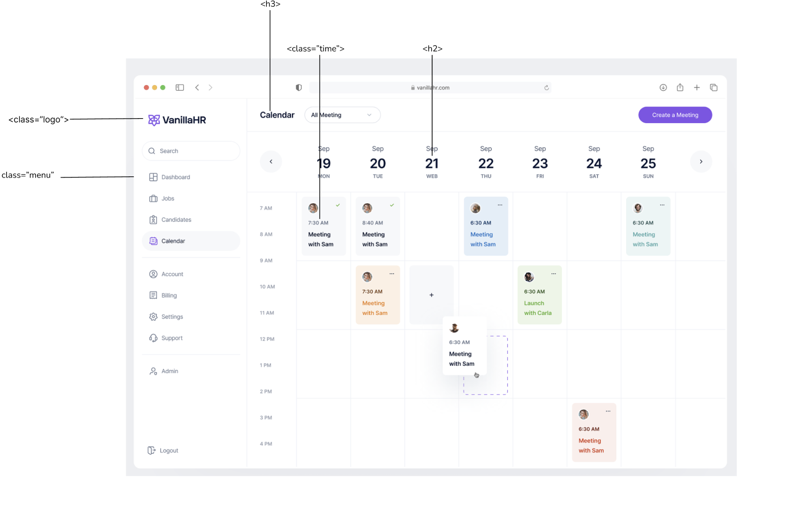

Hello,

I didn't sleep last night because, I wrapped up at around 3 - kept laying on the bed for two hours but couldn't sleep. So, I woke up at 5 and started working. I worked for 2+ hours and then slpet at 8. Woke up at 12, started work at 2. Still the day was so tiring.

Currently I am working on the Typography task, but I don't think I'll be able to complete it because my body isn't obeying me. I think I should sleep and wake up early tomorrow.

Still, here' the Heirarchy project I did. The description is as follows.

`Choose a text that has a recurring structure, such as a table of contents, a news aggregator, or a calendar of events. Analyze the structure of the content (main title, subtitles, time, location, body text, and so on) and create a visual hierarchy that expresses this structure. Make it easy for readers to find the information they want. For example, in a crime report some readers might scan for location, looking for data about their neighborhood, while others might be more drawn to the lurid details of particular crimes. Use changes in size, weight, leading, style, and column structure to distinguish the levels of the hierarchy. Make a style sheet (in a page layout program for print or in CSS for the web) in order to create several variations quickly.`

The [design](https://dribbble.com/shots/18491547-VanillaHR-Calendar-Page) is by [Erşad Başbağ](https://dribbble.com/ersadwork) on Dribble. Although, the design doesn't give proper visual heirarchy as mentioned in the project.
For example, the Calendar text's size is smaller than the dates. Shouldn't it be larger?

Anyways, I'll try to look for a better example tomorrow.

I am hopping off to sleep now.

And yes, meditation day 5 - done.

Toodles!
