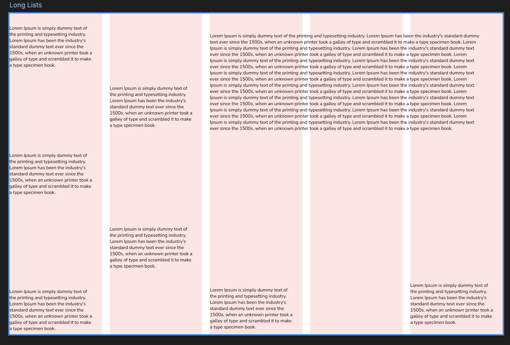

Hello,

Here's my second take on the Heirarchy project.

Then there was this project about Long Lists:
Design a poster that presents the content in a visually interesting way. Work with style sheets to test different type treatments quickly and consistently.

My version:

## Then I studied [Grids](https://web.archive.org/web/20161014001909/http://thinkingwithtype.com/contents/grid).

Notes are as follows:

### Golden Section

- No book about typography would be complete without a discussion of the golden section, a ratio (relationship between two numbers) that has been used in Western art and architecture for more than two thousand years.
- The formula for the golden section is a : b = b : (a+b).
- Side a is to side b as side b is to the sum of both sides. Expressed numerically, the ratio for the golden section is 1 : 1.618.

This section had visual examples, so head over to [this page](https://web.archive.org/web/20161014001909/http://thinkingwithtype.com/contents/grid) in order to revise.

Next project was Modular Grid.

`Use a modular grid to arrange a text in as many ways as you can. By employing just one size of type and flush left alignment only, you will construct a typographic hierarchy exclusively by means of spatial arrangement. To make the project more complex, begin adding variables such as weight, size, and alignment.`

Here's my take:

## Next topic was: Extras (The fries at the end of the bag)

### Type crimes

#### The Crime: Vertical or Horizontal Scaling

HOW TO PLAY: Shown here is a machine for distorting type. As the letters get hit by the evil sprites, they become distorted in the horizontal or vertical direction, yielding effects that are arbitrary, monstrous, and sometimes beautiful.

WHY TO PLAY: Stretching letters distorts their overall proportions and internal line weights. This crime is committed both inadvertently (through careless use of software) and in cold blood (in order to force type to fill a given space).

### The Crime: Dumb quotes

HOW TO PLAY: Destroy the evil hatch marks (a.k.a. dumb quotes) and preserve the good quotation marks (a.k.a. curly quotes).

WHY TO PLAY: Quotation marks consist of distinct characters for opening and closing a quoted passage. Hatch marks consist of a single set of vertical strokes. The only proper use for hatch marks is to indicate inches and feet (5'2").

This marks the end of this task.

I had a call with Inder after that. He asked a few questions about the above tasks and how we can use these in design, and I failed to answer almost all of it.

So, my next task is to implement everything in the the [Letter section](https://web.archive.org/web/20161011001342/http://www.thinkingwithtype.com/contents/letter), especially the type crimes.
Tomorrow's blog is going to be very visually appealing, I guess so.

I also cooked breakfast today.

Here's today's defeat:

A few words about the Sleep deprived Sahib.

Then the cherry on top:

Last but not the least, meditation day 5 - done.

Toodles Doodles!
