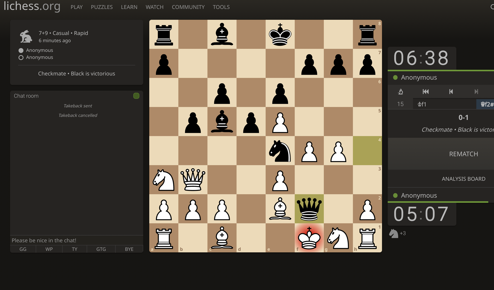

Hello,

I didn't work on the task today. I was so lathergic the whole day - couldn't concentrate in meditation or Paath. Hence, as my daily schedule to meditate first thing - I gave up trying to concentrate - was too overwhelmed.

Later in the evening, I was pissed at something, I got triggered and wanted to react(as my usual self), but I didn't. Then on call with Inder - I meditated. I realised it's just one of those disregulated days.

One of the best things meditation has done is, it makes me slow down and then I am able to appreciate the lovely people in my life, who actually want the best for me - on top of that, they are putting effort for it. It made me realise all the times, I was chasing pain, when all the peace was within me and the ones who truly loved me.

Out of everyone in the world, I should be compassionate towards myself and my emotional roller-coaster on the difficult days. Instead of bashing myself for being lazy, I should have gently asked what my mind and body actually needed. My body wanted to cry, and I let it cry in the meditation.

I am abundantly grateful for the bundles-of-joy wrapped-up people I have in my life. They know who they are, reading this might make them smile - and I hope so.

Also, defeat of the day:

In the evening, I tried training Bruzo. Hopefully he learns to listen to me someday.

Toodles Doodles!
