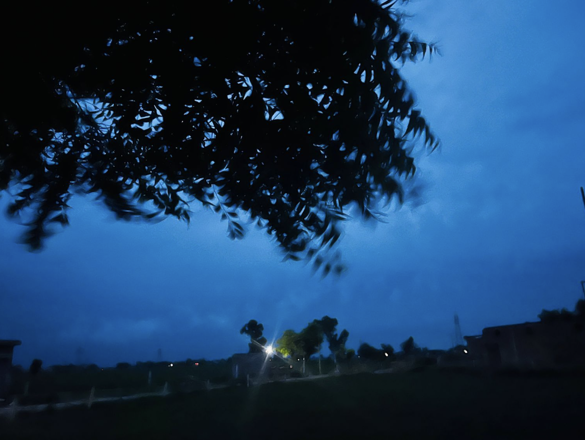
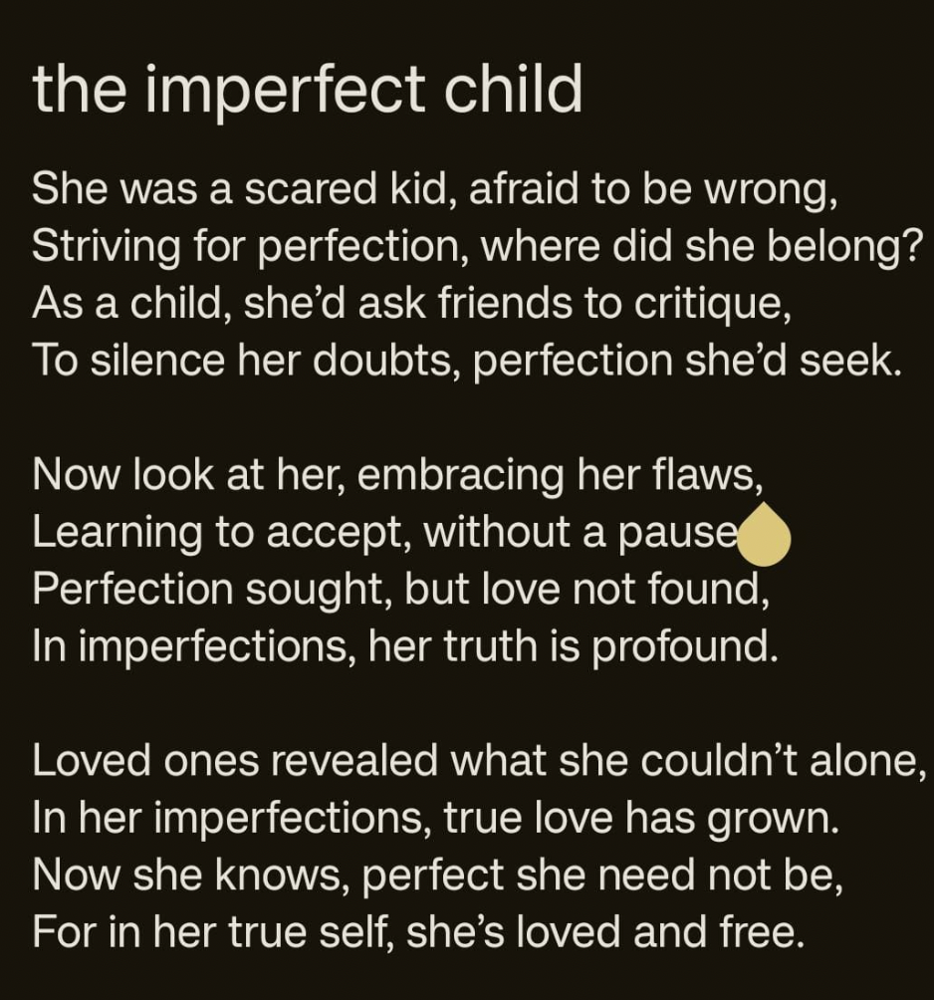
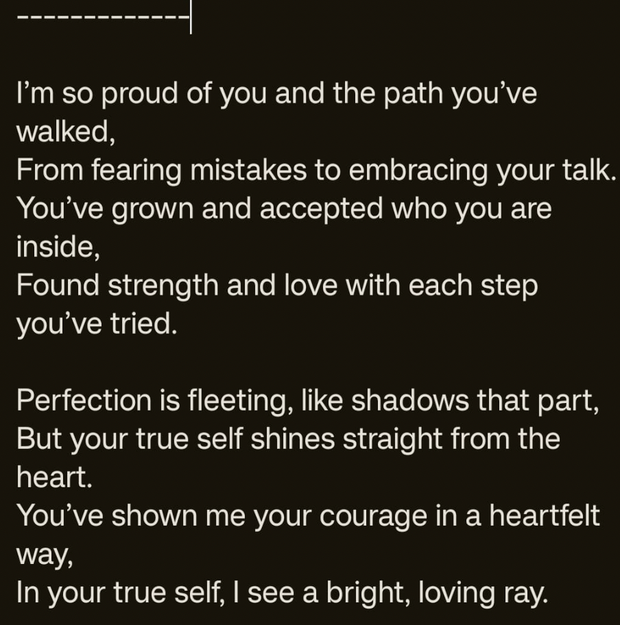
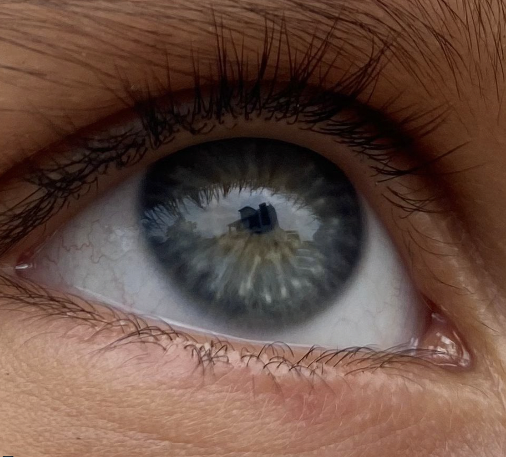

Hello hellu,

Yesterday I woke up at 5am after sleeping at 2am. So, I was basically sleep-deprived. The morning wasn't so bad. I cooked myself some breakfast. Then I tried to get a nap but I couldn't sleep. So, basically whole day was being overstimulated and overthinking. These days, ANYTHING can make cry. Well, I guess it's a package deal.

In the evenin (yesterday), my mom seemed a lil stressed so we meditated together - which I also saw her practice before she went to sleep today.
I didn't meditate in the morning of yesterday but rather at night - during which I almost dozed off and went to sleep right after.

I slept like a baby for about 12 hours.

Today was so productive as well but it was better than yesterday. I ran and had fun in the rain. Did I tell you it rained yesterday too, when I woke up at 5am - the fresh air was soo good. Let me add a picture.

Today bruzo accompanied me in the rain. It was such a wholesome and mindful moment. Bruzo has even been learning to sit and eat on command. Then there was another young calf tied next to Bruzo's post. I asked Samar about the name she'd like to give that lil calf and she said "Kat". So, we are naming her Kat now. Tomorrow Kat's gonna feature in this blog along with Bruzo.

The moment wholesome moments of my day are always the ones where I am outdoors and being in the moment. Which is happening quite frequently or atleast I am able to be grateful for that. I am so grateful for the life I have. I get to pray, eat, enjoy life with my family. On top of that, I have good and supportive friends.

Another thing that gives me fulfillment is being of service to my parents. Being mindful has made me a little conscious about how my loved ones around have been in pain and I didn't notice it. And that to me was very selfish of me. But I know it's a journey, there was a time - I needed my own time the most. The reason I am here talking about it is because of the past version of me. I am not going to bash her.

I don't expect myself to be perfect anyone, I won't do that myself - setting a high bar and then being resentful and harsh for not achieveing it. But rather I am learning and growing as I go on with life. I am more loving towards my parents than I was before because I have no resentment towards them. I see the love they have for me, I see how humble they are. And how insanely lucky I am to have experienced this lifeform with my current family.

A few words from this cosmos about this imperfect child:

Another thing, here's the picture of my nephew's eyes:

Also, the design task I was to do about the type crimes. I did start it but since it's not done yet, I won't add its notes. I will dedicate the entire blog to the type crimes tomorrow after I am done with it.

Last but not the least, I will meditate before I sleep - this will be mentioned in tomorrow's blog.

Till then,
Toodles Doodles
