Hello hellu,

Inder gave me the task of going through this video of [Jason Santa Maria - On Web Typography](https://www.youtube.com/watch?v=aSmCjUFWFew)

I practiced it on [this Figma design](https://www.figma.com/design/ApTK0k76YL117hggHapal0/Typography?node-id=0-1&t=zrNzNHf6a6b4dQuu-0).

Following are the notes.

- If your type is bad, the design fails!
- The term readability doesn't ask simply "can you read it?". It asks "do you want to read it?".
- Typography is hard. There isn't just one book you can read and know it all.
- There are tons of fonts and it's difficult to make a decision on which font to use.
- Because it is not only about choosing the type but has more to do with Understanding type and learning how to see type. Learning how to see the distinguishing features of typefaces, why they are important and what they do.

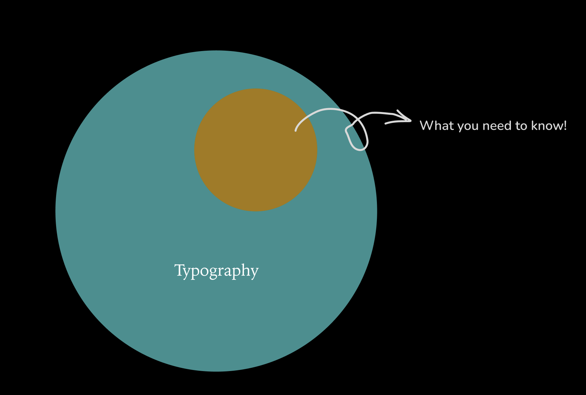

Breaking it down
Q: What makes a typeface good or bad?
A: No typeface is born evil. It's all in how it is used - the context matters.

Q: How to look at type?
A:
"Type is a beautiful group of letters, not a group of beautiful letters." - Matthew Carter

Type is about looking at letters, words, headlines - seeing how actual communication is happening.

Typefaces have inherent roles.
Two kind of roles:

- Display faces: Typefaces which are basically meant to be used large. These have more ornate features, more contrast, are more decorative. The quantity of these typefaces should be less on your webpage.
  Example: Bauer Bodoni, Myriad Condensed, Bello.
- Text faces: Things that are supposed to be used in running text, lots of running paragraphs - meant to be read. These generally have larger x-height to focus on legibility so there's less contrast in the strokes of the characters.
  Example: Le Monde Journal, FF Tisa, FacitWeb.

Look for workhorse typefaces. A typeface that can be used in more than one context.

### Reading and Perception

- Type's a dual life.
- Reading is affected by the principles of typography: Size, line length, x-height, color etc, these contribute or detract from someone's ability to read.
- What we think we see: We think that people see the text in its entirity, the typeface being used, the exact text.
  But people actually see more like its texture, its content - they only notice it when something isn't right.

Saccade: Since we don't see the entirety of it at any given time - our eyes do this short little jumps on the page called the saccade. The length of the saccade depends on how familiar you are with the information or how adaptive reader you are. For example: If you are a scientist reading science stuff, you would read it faster. But if you are reading someone else's handwriting - something that isn't that familiar to you, the sacade might be a lot shorter.
And each time we stop even for the fraction of the second - it's called fixation. Everything else gets blurred.
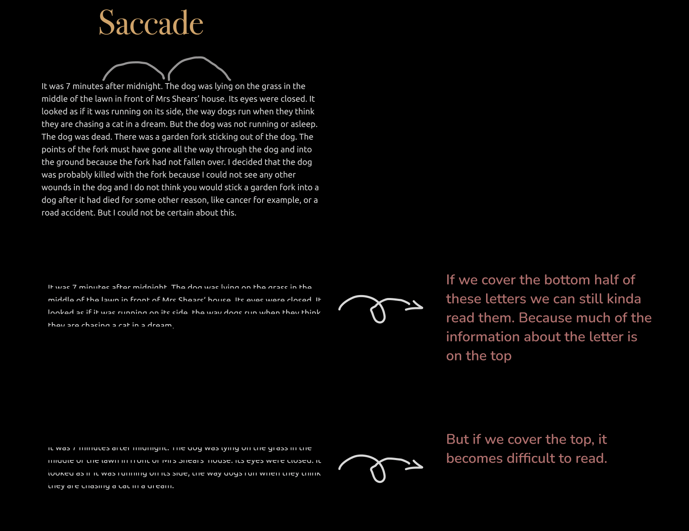

### Good Typography is invisible

- Contrast in quality.
- Typography is an art of contrasts.
- Considerations for design.
- Ther are no rules for typography: There are principle, guidelines, best practices. There are things that work most of the times but there's nothing that works all the time.
- Typography is the art of imperfect precision. You can make a good guess at how well something is going to look.
- Art of reduction: Limit the amount of stuff that you use so that you don't have to worry about the viual language getting messed up. Limitng the number of factors involved in creating a design.
- Simplicity is very hard.

### In Practice

- Bigger is better
  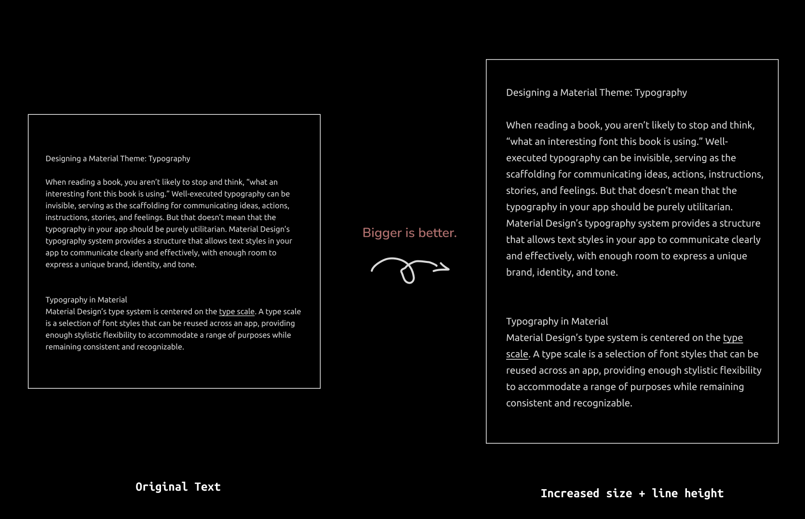

- Contrast is the most important tenet of graphic design. Contrast tells you when something is different than something else - it tells you when something is more important than something else. Basically through that difference you can establish heirarchy and emphasis and that's what drives your design.

"Everything is related to its opposite, everything is defined by its opposite" - Milton Glasor

The big defines the small, the content defines the white-space.
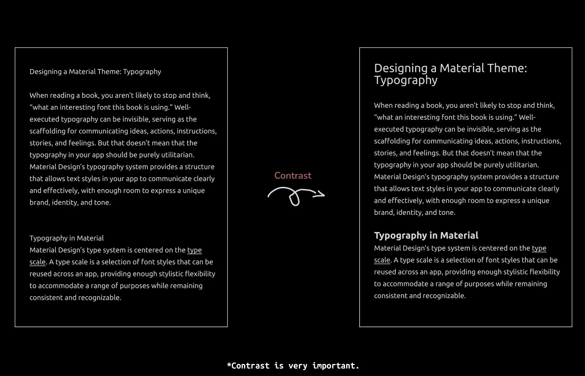

### The Longer the line, the more line spacing.

When the lines are longer, you need more space between them because as you eye gets to the end of the line, it needs that cushion to get back to the front of the line. Because if not, you can get lost going from one line to next. Whereas if your lines are shorter, you can pack them a little tighter.

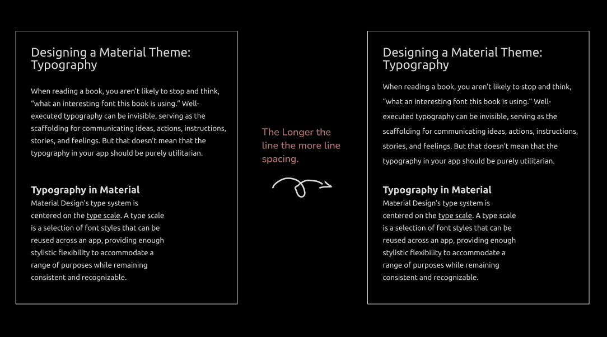

- More color, more line height.
  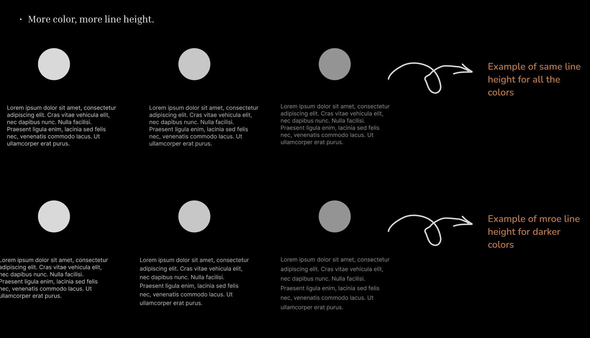

### [Lettering.Js](https://letteringjs.com/)

It is a plugin using which we can have more control over each letter to enchance the typography experience dynamically on our webpage. Ofcourse, we aren't going to use it on the entire page but rather on headings to play around with its letters.

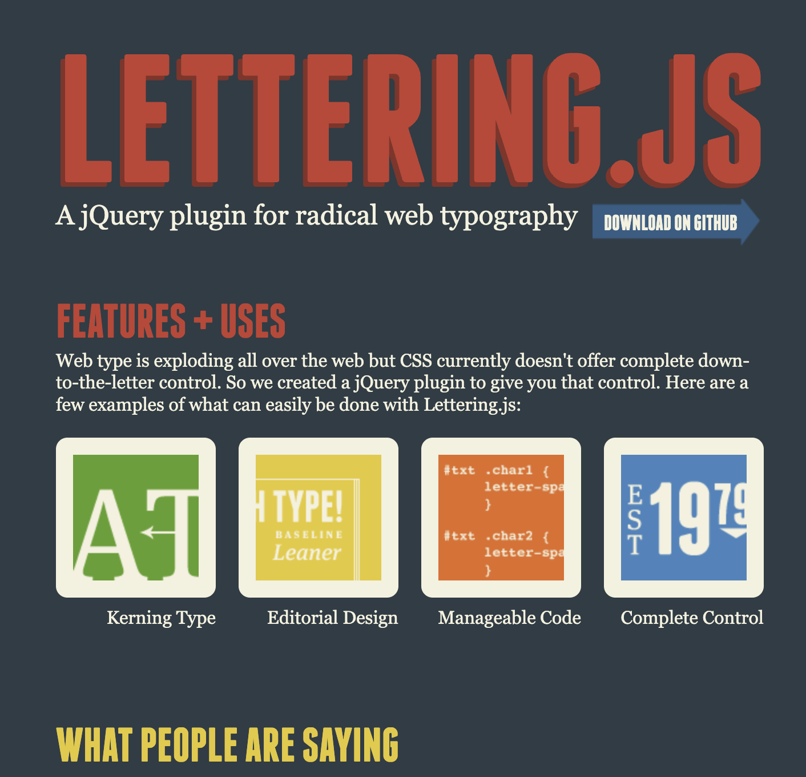

### Methods for choosing font

Can you recommend a good font?
It's an awful question because it doesn't have any context.
Questions to get more context:
What are you going to use the font for?
How will it be used?
Under what conditions?

We'll go for some considerations.

- Dimensions: Are there requirements for how much text must fit in a given region? Do you know how big the things is that you are making - is it a webpage, a book or a magazine? How wide column of text you'll be dealing with.
- Special Features: Do you require any special features in your typefaces? Whether it be special languages.
- Prolonged reading: Maybe it needs to used for something with prolonged reading - having good life span, so people aren't sick of looking at it. Is it a book or long format periodical?
- Internationalization: Does a given font support all the characters in the language being used.

### Distinguishable letters

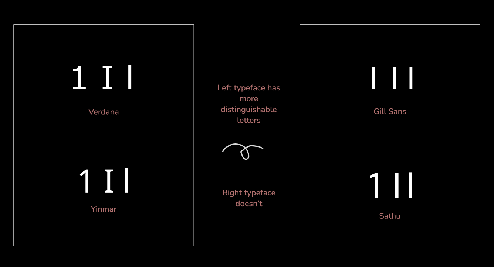

### Avoid readymades

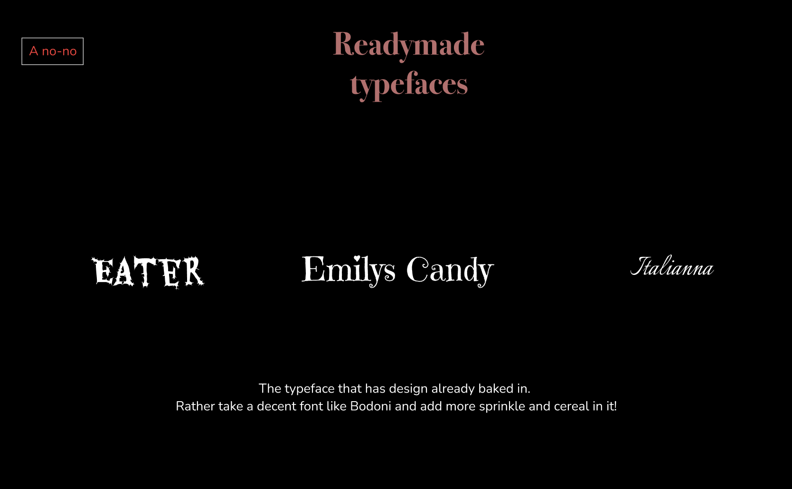

### Developing your personal palette

Find your own type pallete, that you gravitate towards. Use them, keep using them - you don't have tp change typefaces for every project. Get to know your typeface - its strength and weaknesses. It makes you a good graphic designer.

### Research and History

Every typeface has a history baked into it, it has been made at a certain time for certain purpose.

### Mental associations

Write down the terms you want to associate with your design. So that we don't look at letterforms without even knowing what we truly want.
For example as the speaker uses following terms for his website.
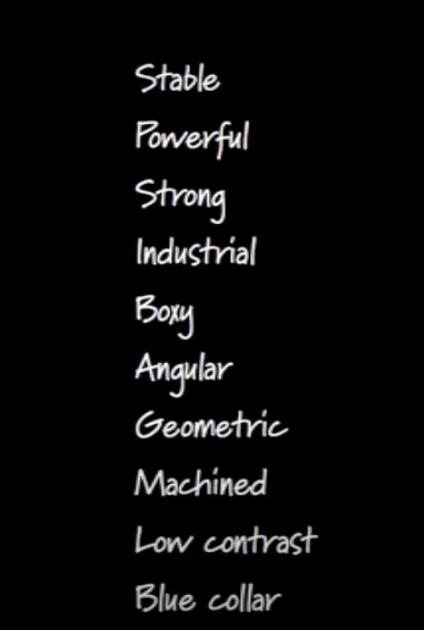
Then he found the typefaces that embody those characteristics.
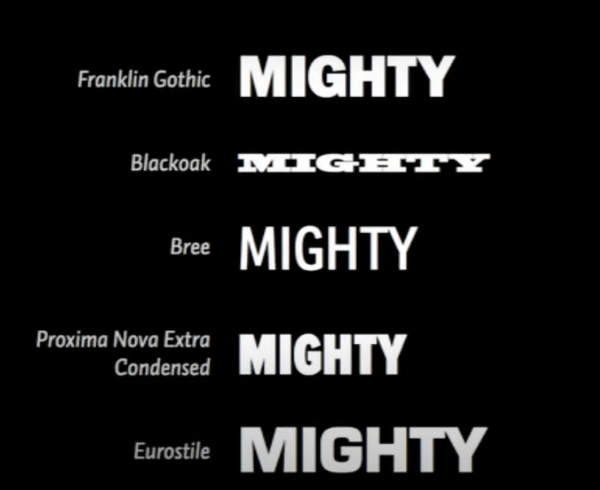

Mental association is a fantastic way to better for starting to understand design.

### Alternates

If you love helvetica, but you are tired of everyone using it. Look closely and see, what makes Helvetica, Helvetica.

- The stroke width is same for all the lines.
- All shapes are based on geometrical shapes
- very high x-height.
- All the terminals end in perpendicular angles. - The counters - the space inside the letters is held onto very tight.

Knowing this - we can look for same attributes and pull out those in other typefaces to use and get that same kind of feel.

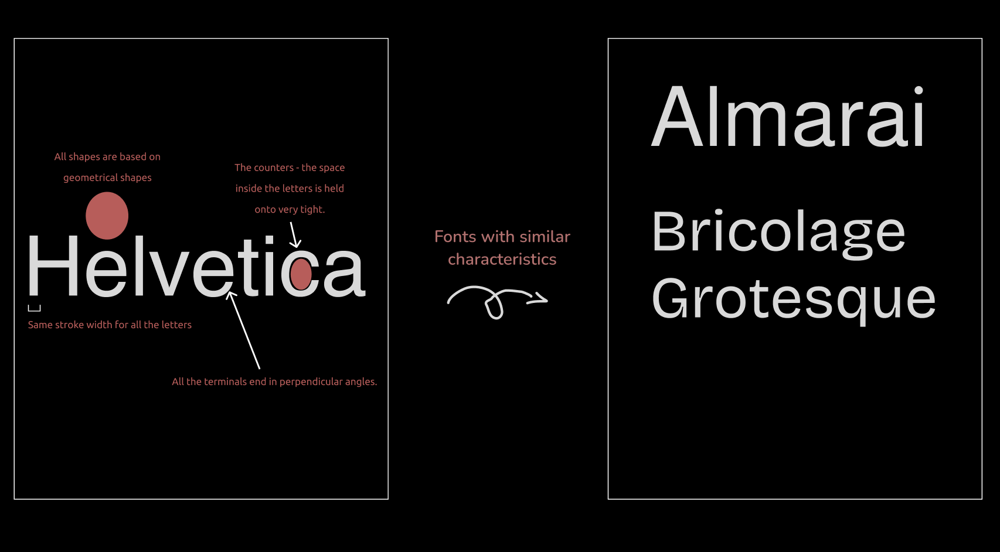

That's it!

Toodles Doodles!
