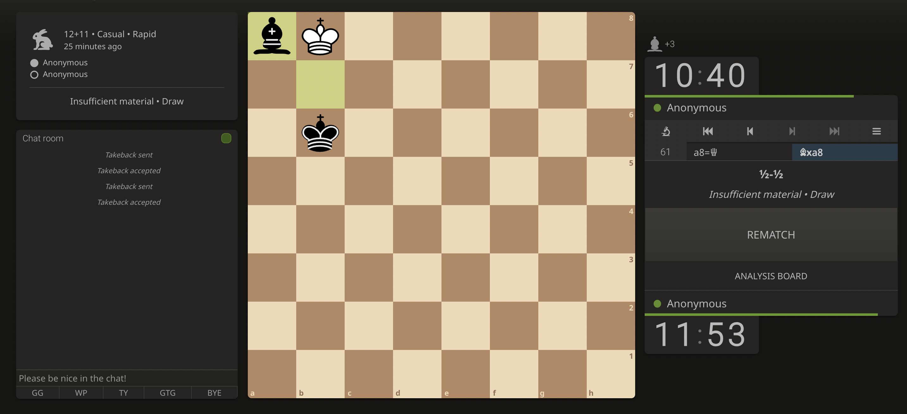

Hello hellu,

Next, here are the notes for today's work:

Product development life cycle:

- **Brainstorm**: Generating ideas about the used and the potential needs or challenges the user might have. Research plays huge role.
- **Define**: Define is all about using the insights from the brainstorm stage and starting to narrow the focus.
- **Design**: In the design stage, UX designers begin to actively develop ideas, and they also check that all specifications from the define stage are realistic
- **Test**: In the test stage, the team evaluates the product design based on feedback from potential users.
- **Launch**: Sharing a finished version of the product with the user.

Responsibilities of entry level UX-designer

- Researching
- Wireframing
- Prototyping
- Creating information structure
- Communicating effectively

The role of a beginner UX designer, I designed this:

Yesterday, I won the chess match. I was white.

And today's match was a draw. white again.

Something for me (from this universe) today:

Tomorrow I aim on completing the module 1.

Also, the blog is named day 1 because I meditated today. The number is going to reset each time I break the meditation streak. Giving it a second thought, I think I'll just keep incrementing the number regardless but if I go a week without meditation, then the number will reset to 1.
That's it!

Toodles Doodles.
