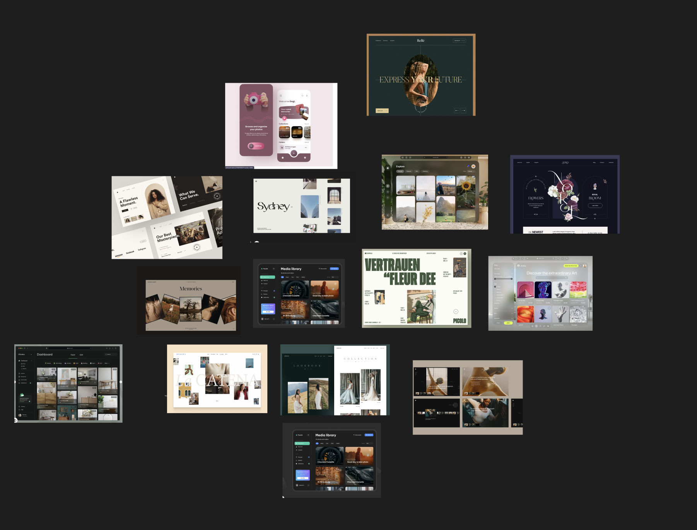

Hello hellu,

In the yesterday's notes, I forgot to note the UX resources mentioned in the course:

- [Ladies that UX](https://medium.com/ladies-that-ux)
- [Growth Design Case Studies](https://growth.design/case-studies)
- [UX Podcast](https://uxpodcast.com/about/)
- [UX Design Blog](https://uxdesign.cc/)
- [UX Planet](https://uxplanet.org/)

I collected design inpirations for the upcoming project:

Today's notes:

Teams that UX designers work with

- **Engineers**: Engineers translate designs into a functioning experience, like an app or a website.
- **UX researchers**: UX research is all about understanding what users need and expect from your product.
- **Program managers**: Program managers ensure clear and timely communication across the team.
- **Product leads**: Product leads are in charge of ensuring the final product’s success and communicating with stakeholders.
- **Other UX designers**: In many cases, you won’t be the sole designer working on a given project, especially if you work at a larger company and when you're a new designer.

I completed Module one of the course Foundations of User Experience (UX) Design.

Module 2 notes

- **Universal design** is the process of creating one product for users with the widest range of abilities and in the widest range of situations.
- **Inclusive design** means making design choices that take into account personal identifiers like ability, race, economic status, language, age, and gender.
- **Equity-focused design** means thinking through all the aspects of a design product and making sure the product is both accessible and fair to all genders, races, and abilities

Universal design: "One design fits all"
Inclusive design: "Solve for one, extend to many"

- In inclusive design, there's no such thing as normal. There's no average person or target audience that we should design for. For example, when designing, we focus on the needs of people who are blind and deaf, even more than we consider the needs of those who rely on their sight and hearing to communicate.
- Designing products, devices, services, or environments for people with disabilities is called accessibility.
- **Equity-focused design** takes the idea of inclusive design one step further. The goal of equity-focused design is to uplift groups that have been excluded historically.

- Equality and Equity are different.
- **Equality**: Equality means providing the same amount of opportunity and support to all segments of society.
- **Equity**: Equity means providing different levels of opportunity and support for each person in order to achieve fair outcomes.

- **Platform**: The medium that users experience your product on. Such as desktops, mobile app, mobile web, laptops, tablets etc.

I will continue Module 2 tomorrow and will now meditate and sleep.

Toodles Doodles
