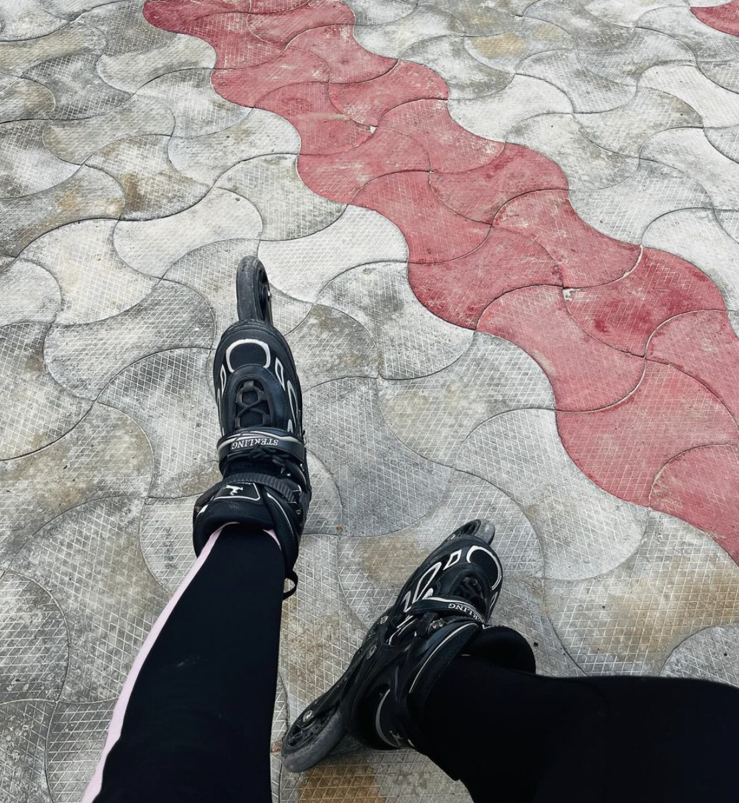
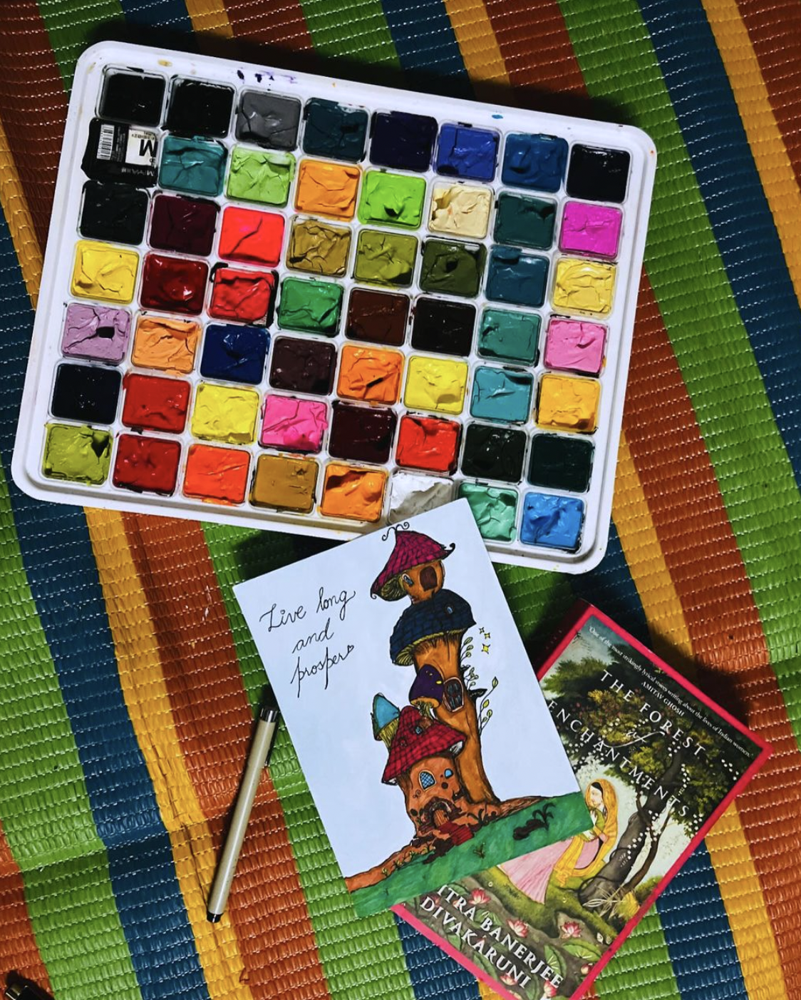

Hello hellu,

I didn't move further in the design course today. Among other things, I am learning to skate these days - today was my 4th day. Here's an image to remember it by.

Also, I meditated for some time - Inder helped me meditate. We talked about Kapalbhati meditation - which has a lot of health benifits too.

Other than that I repainted my old artwork - earlier I colored it using the alcoholic markers. But one thing about alcoholic markers is that some of the colors fade - which creates patches. I recolored the artwork using the gouache paint colors I ordered a few days back.

And yes I forgot to mention that too that I got my gouache paint set. Let me show you.

These colors are by the Himi company. Here's [the link](https://www.amazon.in/THOOVI-Gouache-Colours-Palette-Professionals/dp/B09MP9YT3M/ref=asc_df_B09MP9YT3M/?tag=googleshopdes-21&linkCode=df0&hvadid=544916069163&hvpos=&hvnetw=g&hvrand=10485283788663393753&hvpone=&hvptwo=&hvqmt=&hvdev=c&hvdvcmdl=&hvlocint=&hvlocphy=9144012&hvtargid=pla-1562709513974&psc=1&mcid=74998bab565f3306acc034e2d0afb998) to buy.

I have even recorded clips for the unboxing of these colors. It needs to be edited first. Don't worry, the video link will be shared here.

As for work, I worked on my [CWHQ](https://www.codewizardshq.com/) work, then I worked on the design project. [Khushboo](https://dribbble.com/KhushbooDhiman77/collections) reviewed the moodboard I created. She asked me to add more design inspirations. For tomorrow, she'll add some of her own ideas and then create the first draft. I'll take it from there.

For tomorrow, I have a lot of CWHQ work - but I'll surely make time for the learing part.

See you tomorrow.
Toodles Doodles
