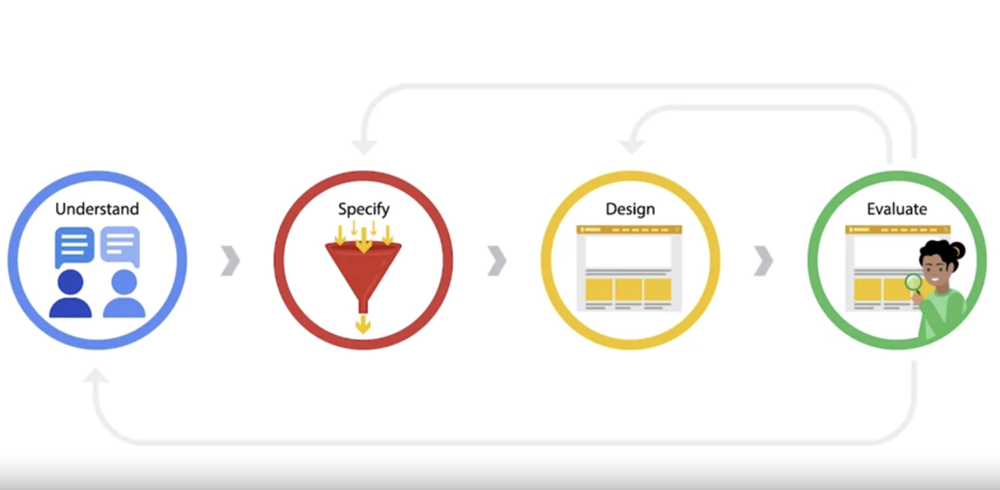

Hello hellu,

User-centric designs:

- It's also important to solve problems that people actually experience, rather than only trying to solve problems you personally experience.
- Focusing on real user problems reduces the impact of designer bias.
- User-centered design puts the user front and center.

Later, I didn't continue continue the course for the rest of the day. I was working on [CWHQ](https://www.codewizardshq.com/) work.

I also got my Rakhdi present from Gurpreet Bhaaji. Such a coool present.

I think I am suffering from lucky-girl syndrome.

I didn't meditate though. I skated in the evening.

Toodles Doodles!
