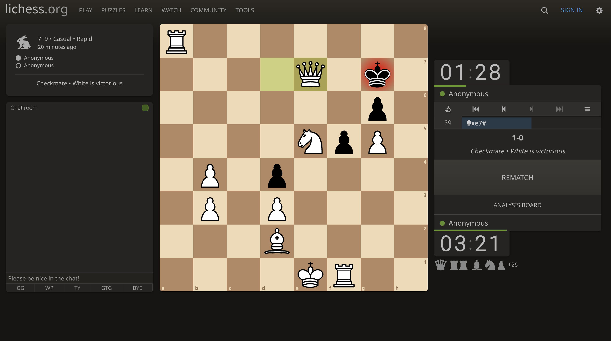
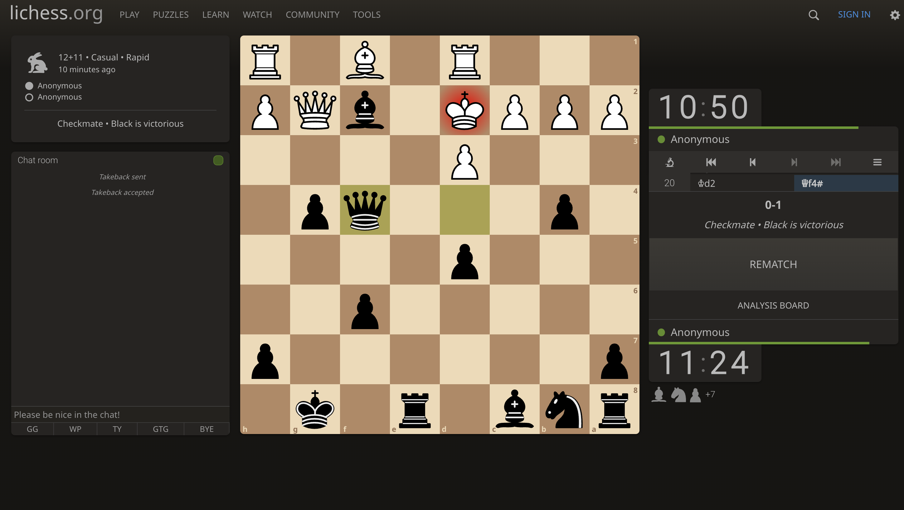

Hello hellu,

To reach as many users as possible, you’ll consider questions such as these as part of your user research approach:

- Do my users have impairments or disabilities to consider–whether temporary, situational, or permanent?
- How familiar are my users with technology?
- How are my users accessing the product or service?
- Where and when are my users accessing the product or service?
- Have I considered all my potential users?

Designing for accessibility isn't an obstacle, but a way to get your products to as many users as possible.

### Qualitative UX research:

- Write a user research brief. A kick off document on why you want to conduct the user research.
- Research Goal: Why you are conducting the research?
- Research Questions: The questions you want the research to answer. The questions should be user-centered. They should be starting with "How", "What", "Why", "Which way"
- The Research Method: Interviews - most of 5 people.

User Research Interviews:
It's important to first define screening requirements. Try to find people who fit your target audience. Use facebook groups or Reddit.

- Use neutral questions.
- Avoid Leading questions
- Avoid Closed questions.

### Quantitative UX Research

On the other hand, generally produces numerical data that can be measured and analyzed, looking more at the statistics. Quantitative data is used to quantify the opinions and behaviors of your users.

### Assistive technology

- Color modification: show high contrast colors to people with low vision or eye strain.
- Voice control: Able to interact with button and screens using voice command.
- Screen readers
- Alterative text: Uses text to explain image. Also used when image fails to load.
- Switch device: An assistive technology device that replaces the need to use a computer keyboard or a mouse.

"The strange thing about UX design is that you won't notice it if it's good design. You only notice when it's bad."

With this the module two (Get to know the user) of Course 1 (Foundations of User Experience (UX) Design) is complete. Tomorrow I'll start the module 3.

I meditated today.
I drank spearmint tea.
Also, I completed the wireframes of the design project I am working on.

Today's chess match was lit:

I was white.

Seems like I am on my winning streak tody.

I was black this time.

Toodles Doodles
