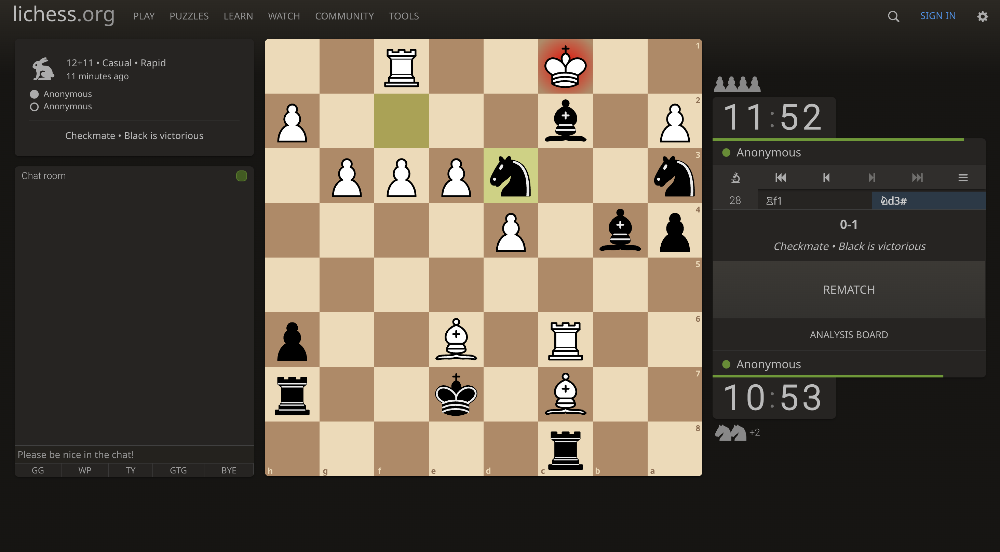

Hello hellu,

Today I finalised the wireframes for the project I am working on. It was a comparitively productive day. I woke up at 6am because I had my akharkaari class today.
Here's today practice:

I went for a run today - seems like I should do it everyday.
We even fried golgappas today.

I didn't work on the course though.

I lost in the chess match today.

But in the second match I won:

I was black this time.

I will meditate before sleeping today.

Toodles Doodles!
