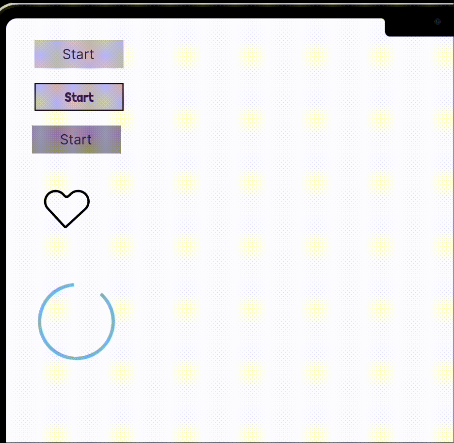
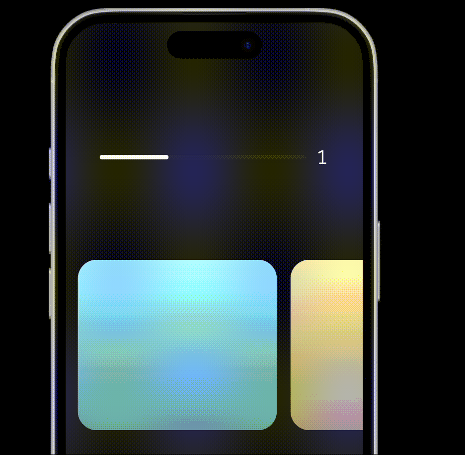

12:00PM: 
It's been a few days I have started meditating again. This is the audio I use for the guided meditation - [Joe Dispensa's Induction audio](https://youtu.be/vS0gPJqra6I?si=CnaR0LpAfHFf4EFO). 
I have even thought of started running, so, today I started my day by going on a walk. I woke up at 7:30 am and went for a walk. Came back, did yoga, had bath and then I meditated. 
I then started learning Animations in Figma. Here's what I did so far! 

3:57PM: 
I did two other animations.

[Another one](https://www.figma.com/proto/TFcOcB2pFSpKvTeta7zx3E/Animation?node-id=21-152&p=f&t=fJSSfJ4eN8jGuupC-0&scaling=scale-down&content-scaling=fixed&page-id=21%3A150)
This one is trippy.

I went for a walk in the evening as well. I cooked dinner today. It was a well rounded day.

9:41pm: 
I am going to sleep now.

This is my step towards 100 days of bringing a change in me. I will keep learning, improving for 100 days straight. [Edit: Due to some other things, I couldn't continue - so I started the same challenge, next month.]

Toodles,
Sahib
