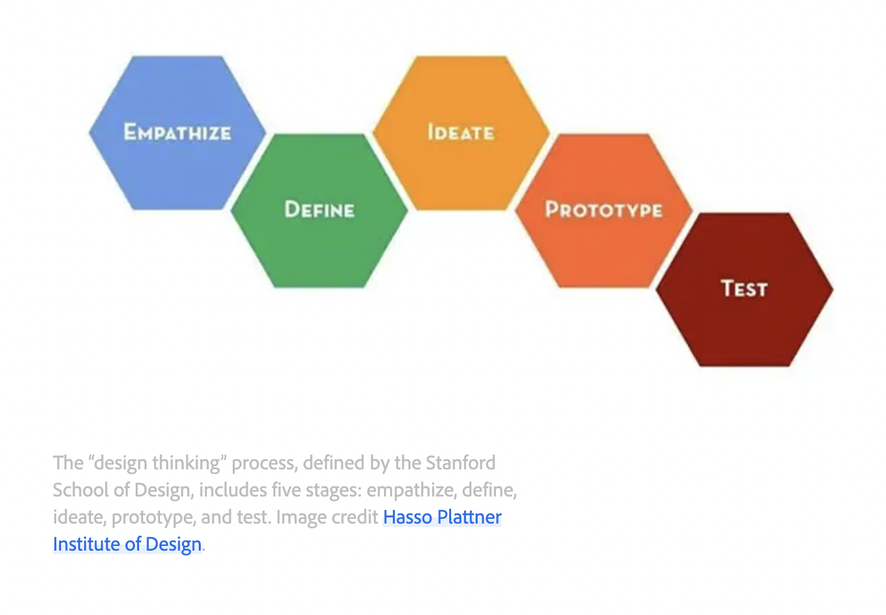

The design thinking framework involves the following phases: empathize, define, ideate, prototype, and test.

 
No matter which frameworks you use in your career, they all have a few core principles in common:

- Focus on the user.
- Create solutions that address the user’s problems.
- Collaborate with teammates across departments
- Validate your designs.
- Iterate as needed to design the right user experience.

A design mindset is not problem-focused, it's solution-focused, and action-oriented. It involves both analysis and imagination.

Design Sprints: A design sprint is a time-bound process with five phases typically spread out over five full, eight-hour days.

The goal of design sprints is to solve a critical design challenge through designing, prototyping, and testing ideas with users.

Beefore launching into a design sprint, you need to review your design challenge and ask yourself these key questions:

- Are there many potential solutions to your design challenge?
- Does a design challenge require people from cross-functional teams to weigh in?
- Is the design challenge's scope wide enough for a sprint? If you answered yes to any one of these questions, a design sprint might be the right move.

The design thinking framework:
- Is an overarching framework with five phases: Empathize, Define, Ideate, Prototype, and Test
- Is an overall philosophy for approaching problem solving
- Spans the entire product development process and is open-ended.
- Utilizes many different methods and tools

A design sprint is:
- A time-bound process with five phases: Understand, Ideate, Decide, Prototype, and  Test
- A specific implementation plan for solving a specific design challenge
- Strictly timebound from start to finish, typically spread over five full business days.
-   One method with a defined process 

Toodles,
Sahib
